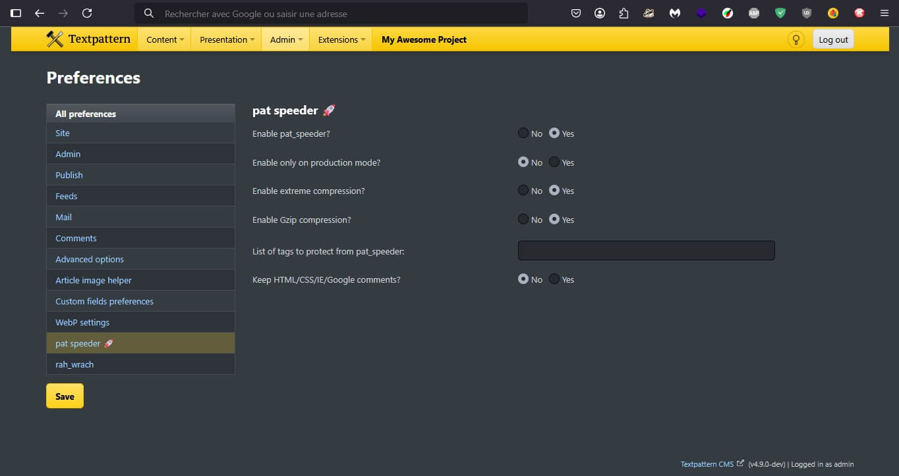

# pat-speeder   

A Textpattern CMS plugin. 

Initially inspired by strategies used by Google and Yahoo!, the pat_speeder plugin for Textpattern CMS compresses your pages into a single line of code before sending them to browsers.

The process is immediate. By removing tabs, line breaks, comments and unnecessary spaces (which are all absolutely not necessary for your site to display properly), your pages are accelerated. Speed ​​increases by up to 10-20%! Generally (observed results), Google Page Speed Insights scores are better (100/100, or close to it)!

pat_speeder is non-intrusive: your templates and CSS style sheets are not affected. You maintain your organization. Your code remains readable, as you designed it, and only for you. The effectiveness of pat_speeder benefits your visitors” experience.

Simple and easy to use, a single tag to instantly boost your websites.

This plugin’s settings depend on two independent options:

    By the options available in the plugin’s preferences panel (with precedence based on tag attributes on demand);
    By its tag attributes.

Remember: regardless of your choices, you must specify the mandatory <txp:pat_speeder /> tag into all your pages.

Warning: This plugin seems not to be compatible with some Flash audio players (to be confirmed; however, Flash is no more used).

Additionally, to preserve the spaces before and after each link (« a » tags), spaces are kept between each HTML code to preserve the visual appearance. However, these extra spaces are not part of natural and well-written text content. Keep this in mind: write quality content and optimize compression (in particular, spaces between <a> tags will be removed). In this context, an additional preference is available for « Compact Compression », which removes all spaces (default: « false »). In this case, it is recommended to manually add them before and after (&nbsp;).

According to [Ruud van Melick](https://vanmelick.com/)'s observations, this plugin results in a reduction of between 5% (for precompressed pages) and 6% (normal pages).

Included automatic server side GZIP compression, if available, gives an average additional benefit of 75%.

## Preferences settings

After installation, go to your website preferences:

**Enable pat_speeder?** Enable or disable the plugin rendering on all your pages where it is used (only if the "enable" attibute is set on "1");

**Enable GZIP compression with pat_speeder?** Choose to activate the internal GZIP compression if needed (you may set your .htaccess file instead) only if the gzip attribute isn't set in this plugin tag;

**List of tags to protect from pat_speeder:** a comma separated list of tags that the compression should skip. Default: `script, svg, pre, code`. Note: `textarea` is included in the plugin;

**Enable extreme compression?** This is a “compact mode” that removes all unnecessary spaces (to be precise: *2 or more*) between all tags to return a smaller document in size. Bear in mind that your page and form markup must be cleanly written without additional spaces around tags. This can otherwise result in unexpected results such as text content directly adjacent to one another (e.g. a link running straight into text). As such, this settings is recommended only for advanced users.

After installation, go to your website preferences:

**Enable pat_speeder?** Allows you to enable/stop rendering of this plugin on all your pages where its tag is used (not in case the enable attribute is set to 1);
**Enable only on production mode?** Allow you to choose in which context to use the plugin;
**Enable GZIP compression** with pat_speeder? Choose to activate the internal GZIP compression if needed (you may set your .htaccess file instead) only if the gzip attribute isn’t set into this plugin tag;
**List of tags to protect from pat_speeder** A comma separated list of tags to protect against the plugin throughout all the site. Default: script, svg, pre, code. Note: textarea is included into the plugin;
**Enable extreme compression?** This is a “compact mode” that removes all unnecessary spaces (to be precise: 2 or more) between all tags to return a smaller document in size. Bear in mind that your page and form markup must be cleanly written without additional spaces/tabs around tags. This can otherwise render in unexpected results such as text content directly adjacent to one another (e.g. a link running straight into text). As such, this setting is recommended only for advanced users.
**Keep all HTML/CSS/IE/Google comments?** Set to Yes, this setting keeps all these elements (if you choose No, Google comments will be removed but not its wrapped content).

Note: All preferences of this plugin can be overridden by the corresponding plugin attributes.

## Attributes

This plugin has the following attributes:

**enable** (boolean): set to 1 activate the plugin. Set to 0 disabled it. Default 1 (yes).
(this attribute overwrite the corresponding plugin’s preferences : usefull if you want select some pages unchanged)
**gzip** (boolean) (optional): server side gzip compression. Default: 1 (true).
(this attribute overwrite the corresponding plugin’s preferences)
**code** (string) (optional): a comma separated list of tags name on which do not apply compression. Default: script,svg,pre,code
(this attribute overwrite the corresponding plugin’s preferences)
**compact** (boolean) (optional): further reduction by removing all duplicate spaces. See note in documentation).
(this attribute overwrite the corresponding plugin’s preferences

Note: All these attributes override the corresponding preferences of this plugin on demand depending on individual pages.

Advice: You may not need to keep your JavaScript unchanged: it is recommended to take advantage of specific compression tools to use optimized code in production.

